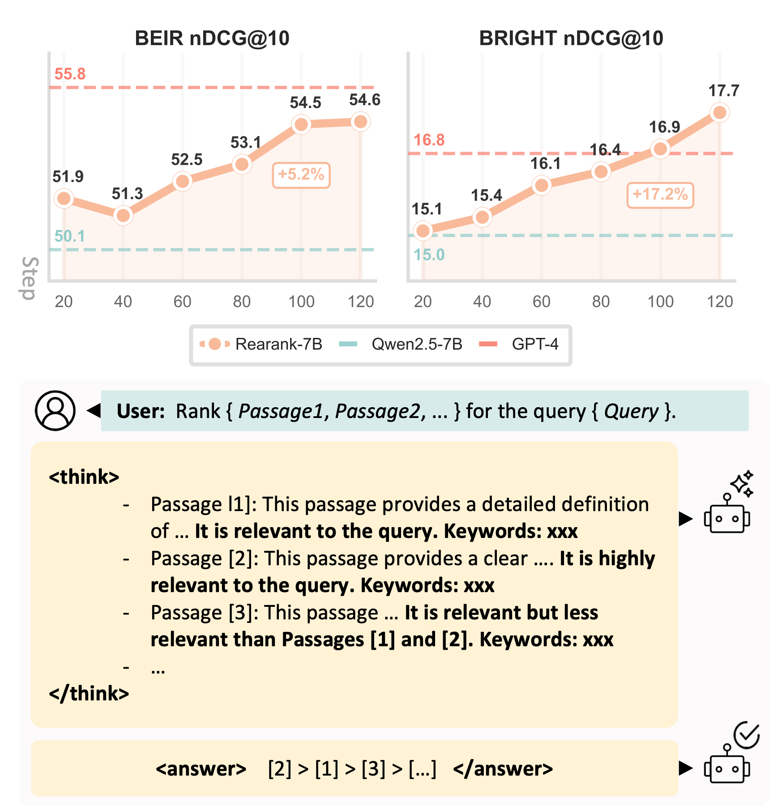
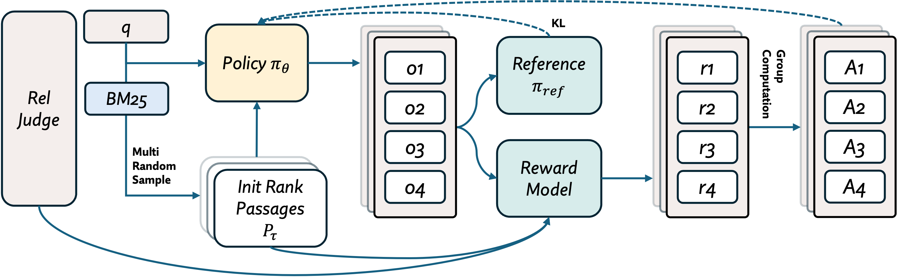

# Rearank: Reasoning Re-ranking Agent via Reinforcement Learning 

[](https://arxiv.org/abs/2505.20046)
[](https://www.apache.org/licenses/LICENSE-2.0)


## Overview

Rearank is an innovative **listwise reasoning reranking agent** powered by a specialized large language model (LLM). It significantly enhances information retrieval by employing **explicit reasoning** to reorder search results. Built upon **Qwen2.5-7B**, Rearank achieves performance comparable to GPT-4 while remarkably requiring **minimal annotated samples** for training.


## Key Features

Rearank stands out with several technical advancements:

* **Reinforcement Learning:** Leverages reinforcement learning to dramatically improve its reasoning capabilities for reranking.
* **Superior Performance:** Demonstrates significant improvements over existing baseline models in information retrieval tasks.
* **Explicit Reasoning:** Specifically designed with explicit reasoning for each passages when reranking.

<div align=center>

</div>


## Installation

Getting started with Rearank is straightforward:

```bash
# Clone the repository
git clone https://github.com/yourusername/Rearank.git
cd Rearank

# Install dependencies
pip install -r requirements.txt
```

For BEIR and TREC-DL datasets, Pyserini will automatically download the required files.
For the Bright dataset, you'll need to manually download and extract the files (including qrels, queries, and passages) using:

```
wget https://huggingface.co/datasets/le723z/bright_tar/resolve/main/bright.tar.gz?download=true && tar -xvf bright.tar.gz -C data/ && rm bright.tar.gz
```

## Usage

The model is available at [Rearank-7B](https://huggingface.co/le723z/Rearank-7B)

Here's how you can use Rearank for your reranking tasks:

```python
from rank_gpt import process_rank_results_in_batches, bm25_retrieve
from utils import get_hits_from_run_bright
from agent import get_agent
from trec_eval import eval_rerank
import os

# Initialize the Rearank agent
agent = get_agent(model_name="le723z/Rearank-7B", api_key=None)
enable_thinking = True # Set to True to enable explicit reasoning traces

# Example usage with different datasets
for data in ['dl19']: # You can iterate through multiple datasets like 'dl19', 'bright', etc.
    if data in BRIGHT: # Assuming BRIGHT is a predefined collection of datasets requiring specific handling
        bm25_results = get_hits_from_run_bright(os.getcwd(), data)
    else:
        bm25_results = bm25_retrieve(data, top_k_retrieve=100)

    # Evaluate original BM25 results
    original_metrics, _ = eval_rerank(data, bm25_results)
    print(f"Original BM25 metrics for {data}: {original_metrics}")

    # Rerank results using Rearank
    rerank_results = process_rank_results_in_batches(
        agent,
        bm25_results,
        batch_size=16,    # Number of queries to process in parallel
        window_size=20,   # Size of the reranking window
        step=10,          # Step size for the sliding window
        enable_thinking=enable_thinking
    )

    # Evaluate reranked results
    rerank_metrics, _ = eval_rerank(data, rerank_results)
    print(f"Rearank metrics for {data}: {rerank_metrics}")
```


## Benchmarks

To reproduce our benchmark results or run evaluations on your own, use the `run_evaluation.py` script:

```bash
# Evaluate on TREC-DL 19, 20, and BEIR datasets
python run_evaluation.py --model_name le723z/Rearank-7B --skip_existing --standard --enable_thinking --log_name cotprompt

# Note:
# --standard evaluates on TREC-DL 19, 20, and BEIR datasets, which requires pyseriny.
# --bright evaluates on the BRIGHT dataset, which needs to be downloaded manually.
```

## Training

Comming soon



## Citation

If Rearank proves useful in your research, please consider citing our paper:

```bibtex
@misc{zhang2025rearankreasoningrerankingagent,
      title={REARANK: Reasoning Re-ranking Agent via Reinforcement Learning},
      author={Le Zhang and Bo Wang and Xipeng Qiu and Siva Reddy and Aishwarya Agrawal},
      year={2025},
      eprint={2505.20046},
      archivePrefix={arXiv},
      primaryClass={cs.IR},
      url={[https://arxiv.org/abs/2505.20046](https://arxiv.org/abs/2505.20046)},
}
```


## Contact

For any questions or feedback, feel free to reach out directly to **le.zhang@mila.quebec**.